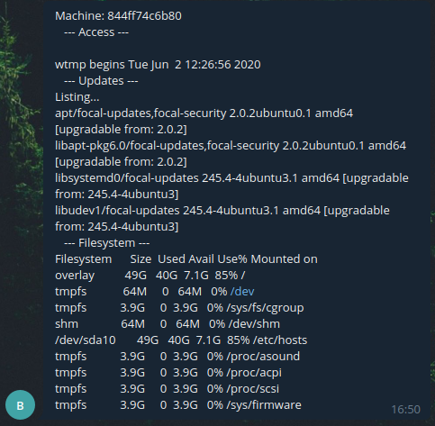

# Telegram bot

Trying a telegram bot from a container to send system info.

## How-to

### 1) Create a bot with BotFather in telegram
### 2) Copy bot's token
### 3) Create a public group and copy its link (@...)
### 4) Add bot to your new group
### 5)

```bash
sudo docker run --rm -it ubuntu
# Now we are inside the container
apt update && apt install -y curl nano
cd                  # Enter home directory (optional)
nano script.sh      # Copy script.sh file content
chmod +x script.sh
./script.sh         # Check if it works
```

Here is the [script.sh](https://github.com/brauli0/docker-utils/blob/master/telegram-bot/script.sh)

### And this is the result:

